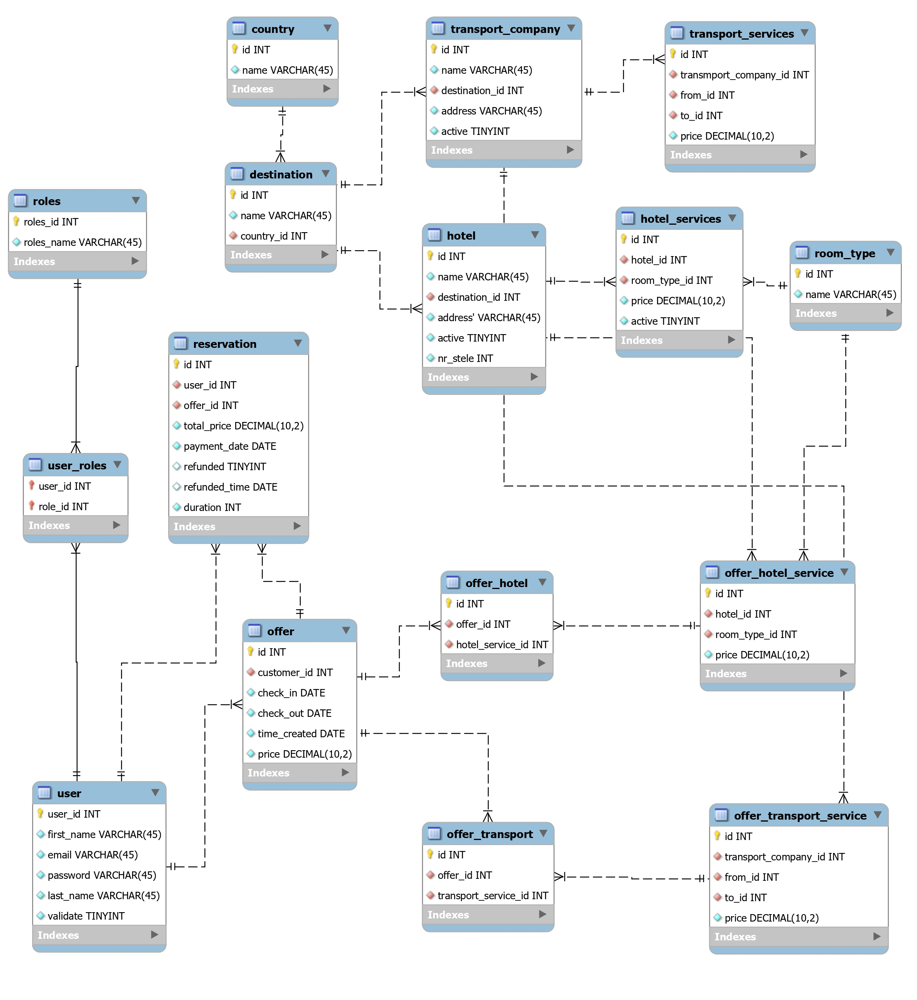
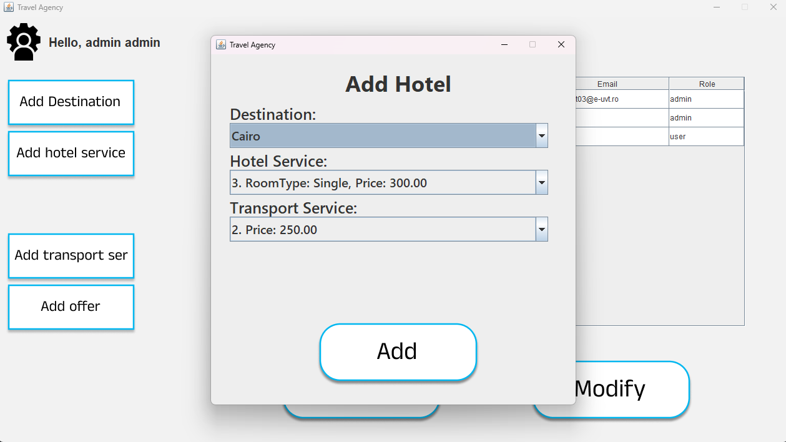
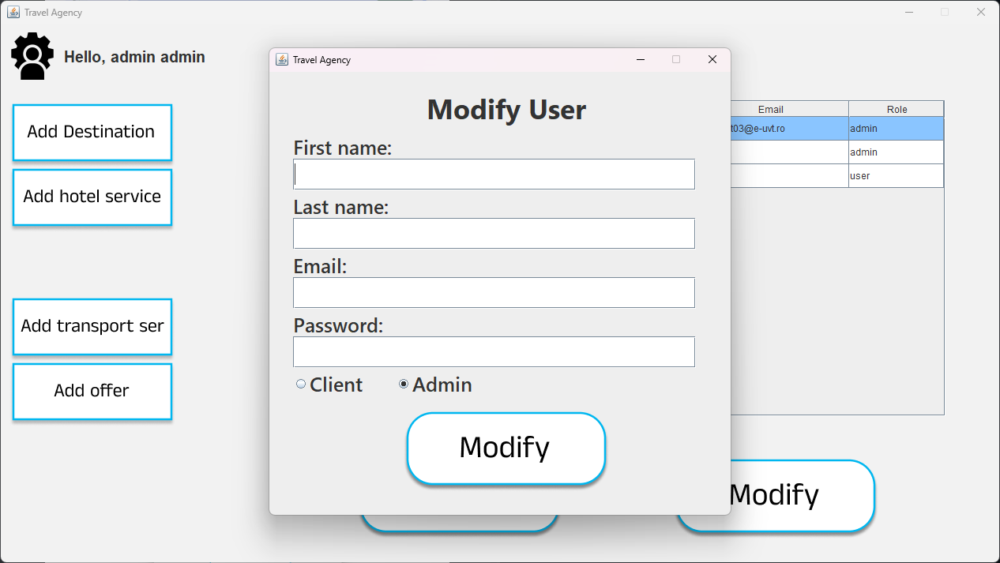
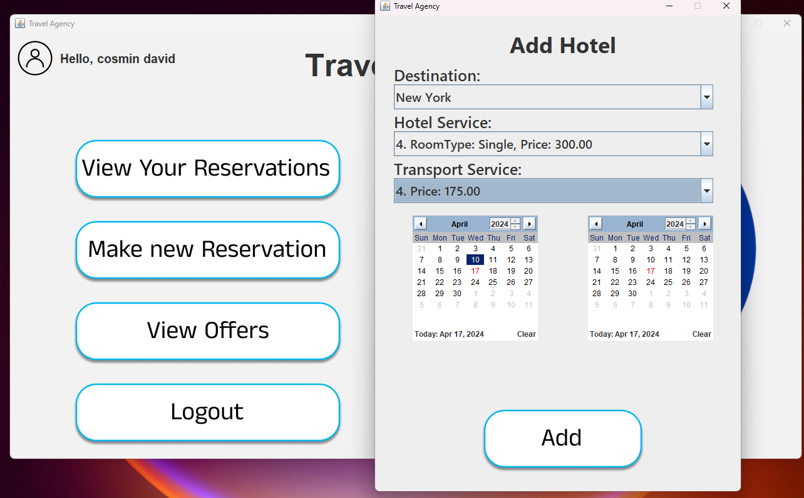

# Travel Agency
### Denys-Florin Cot

## Administration aplication for a travel agency

Depending on their role, users can be either clients or administrators. Clients can use the application to schedule their next vacation as they wish, being able to choose various destinations, along with their own hotels and transportation options within the limits of their accessibility. Of course, they will also have access to a series of ready-made offers for visiting various locations in the available countries. The administrator will be able to change the availability of various services (both accommodation and transportation). Additionally, they will have access to the catalog of bookings recorded in the database, being able to change their status as needed.

## Objectives

* Registration method
* Login method
* Choosing an offer from a predefined set
* Creating your own offer by selecting the destination and desired services (accommodation and transportation).
* Adding predefined offers.
* Managing bookings
* Managing the availability of a service
* Password change method

## Architecture

For the user interface I used the Java Swing framework and for storing the data MySQL was used.

DataBase Schema

## Functionality/Usage Examples
* Adding a destination/hotel/transport company
* Modifying the availability of a service/destination
* User authentication/registration
* Managing users and their bookings
* Adding a predefined offer
* Choosing a predefined offer
* Creating a custom offer
* Making/canceling a reservation

### Resources
Markdown Guide, [Online] Available: https://www.markdownguide.org/basic-syntax/ [accesed: Mar 14, 1706]
